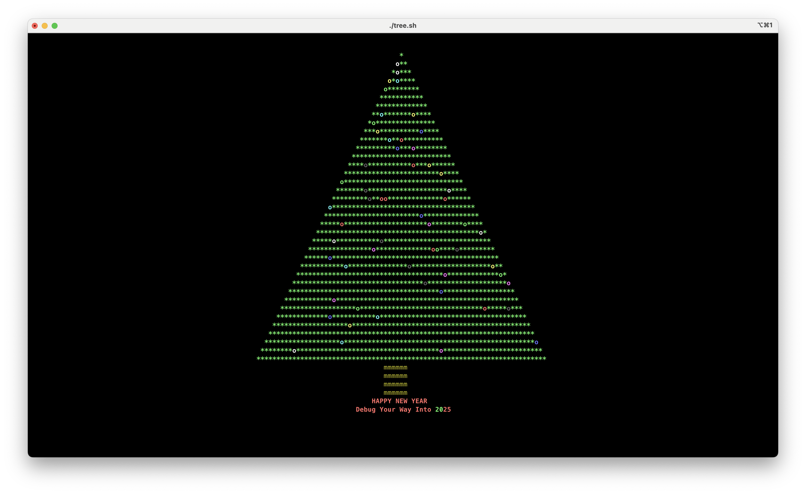

# New Year Terminal Tree 🎄

A bash script that generates a beautiful New Year tree in your terminal! This project is adapted from [sergiolepore/ChristBASHTree](https://github.com/sergiolepore/ChristBASHTree) with modifications to make the tree scale according to your terminal size.



## Quick Start

You can run this festive tree generator in several ways:

### Using curl

```bash
curl -s https://raw.githubusercontent.com/eapotapov/ny-terminal-tree/master/tree.sh | bash
```

### Using wget

```bash
wget -qO- https://raw.githubusercontent.com/eapotapov/ny-terminal-tree/master/tree.sh | bash
```

### Clone and Run

```bash
git clone git@github.com:eapotapov/ny-terminal-tree.git
cd ny-terminal-tree
bash tree.sh
```

## Credits

This project is based on [sergiolepore's ChristBASHTree](https://github.com/sergiolepore/ChristBASHTree), modified with terminal-size awareness and New Year theming.
